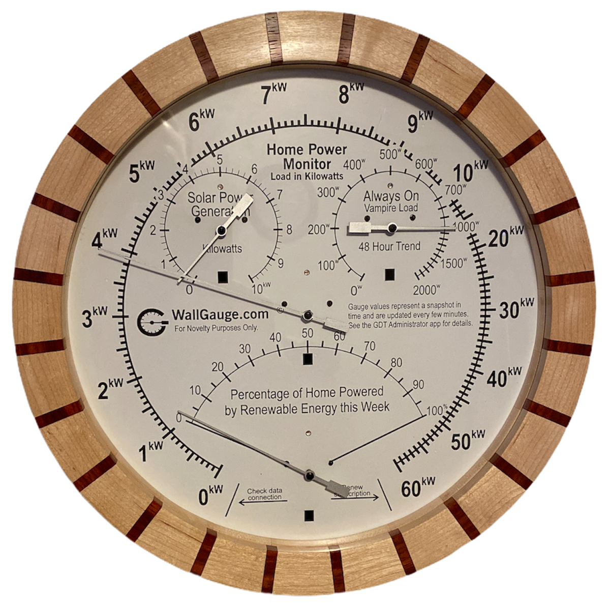

# Sense Power Gauge

This WallGauge displays your home power consumption and solar power production.  It is based on data from the sense [solar power monitor](https://sense.com/solar/).  The gauge is intended to give you a snapshot of your home’s power usage.  The data for each gauge is created by averaging one minute samples every five minutes.  This gives you a view of what the power usage and production were over the last five minutes.  This gauge is not a real time gauge it shows five minute averages.  The sense app does an exceptional job of giving you real time data and this gauge is not a substitute for that.

## Deeper Dive

The sense WallGauge is a collection of four gauges on one gauge face.  Each gauge has a unique data source and are all sourced from the [unofficial sense API](https://community.sense.com/t/official-api/2848).  I have created a node.js data delegate called the [senseDataGetter](https://github.com/WallGauge-GaugeApps/senseDataGetter) that makes the API calls and returns the data to this gauge app. The sense Data Getter and this gauge app are open source library’s and you're welcome to improve or use these library’s in your own projects.

### Gauge Walk-Through

- Outside ring (main gauge). The main gauge shows the current home power usage (averaged over 5 minutes).  The gauge values are shown on a scale made of two ranges.  The first range is from 0 to 10 and the second range is 10 to 60.  All values on this gauge are in kilowatts.  The value shown is an average of the total power used by your home over the last 5 minutes.
- Solar Power Generation (upper left gauge). The solar power gauge face has a simple range from 0 to 10 kilowatts. The data is based on the calculated solar power (from the two current clamps) as it connects into your power distribution panel.  The value shown is an average of the solar power delivered to your home over the last five minutes. 
- Always on Vampire Load (upper right gauge).  This shows the vampire load over the last 48hours.
- Percentage of Power from Renewable Energy this Week (bottom center gauge). This gauge has a range from 0 to 100 percent.  It shows the “Solar this week” trend value from sense home monitor.  The data is reset every Monday morning.  It shows the percentage your home was powered by solar for the week.  

### Error indicators

All WallGauges require a [WallGauge.com Gauge Data Transmitter](https://www.wallgauge.com/) (GDT) to run their gauge app. The GDT gives a gauge app a platform for getting gauge data from the Internet and beaming it (with infrared LEDs) to the WallGauge.  

At the bottom of the main gauge you will find two error indicators labeled “Check data connection” and “Renew subscription”.

- Check data connection. If the GDT is powered off or cannot connect to the data source it will stop sending infrared data to this gauge.  If the gauge does not receive data for 20 minutes it will move the needle to the Check data connection position.  This lets the user know something is wrong with the GDT or the data connection.   Check your wireless network connection and make sure your GDT has access to the Internet.
- Renew subscription. Each GDT requires a support subscription if this subscription has not been renewed, the GDT will move the needle to the Renew subscription position and stop displaying the gauge value.  Renew this GDT’s subscription or move the gauge to a GDT that has an active subscription and install this gauge app.

## Data Source

The data for this gauge is from the sense home monitor’s data on the sense cloud.  I’m currently working on obtaining some type of official statement from sense on the use of this data.  I don’t think it will be a problem based on their support forum post and the fact they acknowledge people are using their cloud data in this way.

## Security

This gauge requires you to give it your sense login ID and password so it can access your sense home monitor’s cloud data.  This login ID and password are encrypted and stored on your GDT.  We do not keep a copy of it in the cloud it is only used to access your sense data.  However, if your GDT is physically stolen or compromised your login ID and Password may be accessible.  Please follow best practices with your sense passwords.  We highly recommend you do not use the same password with other services.

## Purchase this gauge

As stated above we are working on details and permission to sell a gauge based on sense cloud data.  At this point as of July 20, 2020 we are not selling this gauge.   If you are interested in buying a gauge or a kit please go to WallGauge.com and fill out the form at the bottom of the page.  In the message section let me know you are interested and I will reach out to you when we and if we start selling them.

## Gauge Pictures

